### 1. Realiza una exportación del esquema de SCOTT usando Oracle Data Pump con las siguientes condiciones: 
#### • Exporta tanto la estructura de las tablas como los datos de las mismas. 
#### • Excluye la tabla BONUS y los departamentos con menos de dos empleados. 
#### • Realiza una estimación previa del tamaño necesario para el fichero de exportación. 
#### • Programa la operación para dentro de 2 minutos. 
#### • Genera un archivo de log en el directorio raíz.

Para poder realizar este ejercicio, tendremos que seguir la siguiente guía de comandos. 

Primero tendremos que conectarnos a la base de datos y ver que estamos conectados a la base de datos con el USER correcto con los siguientes comandos:

```sql
sqlplus scott/scott
show user;
```

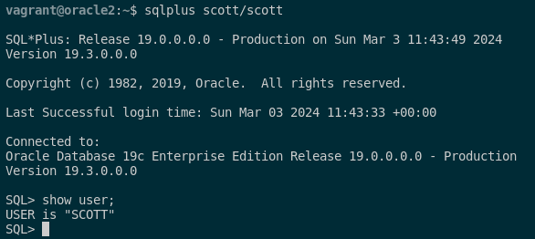

Tras esto, deberemos crear un directorio donde se guardará el archivo donde vamos a realizar el movimiento de los datos y el archivo de registro.

```sql
sudo mkdir /opt/oracle/datapump
sudo chown -R oracle:oinstall /opt/oracle/datapump/
```

Seguido de esto, accederemos a SQL*Plus y accederemos como DBA y ejecutaremos el sigueinte comando:

```sql
CREATE DIRECTORY datapumpora AS '/opt/oracle/datapump';
```

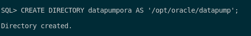

Cuando ya lo tengamos creado, le tendremos que dar los permisos al USER scott para leer y escribir en dicho directorio y también le tenemos que dar permisos para poder realizar una exportación completa. Estos los comandos en cuestión:

```sql
GRANT READ,WRITE ON DIRECTORY datapumpora TO scott;
GRANT DATAPUMP_EXP_FULL_DATABASE TO scott;
```

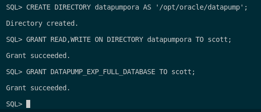

Tras esto, pasaremos a crear una estamación del tamaño necesario para el archivo de exportación respectivo. Para ello utiklizaremos el siguiente comando:

```sql
expdp scott/scott DIRECTORY=datapumpora LOGFILE=estimacion.log EXCLUDE=TABLE:\"=\'BONUS\'\" ESTIMATE_ONLY=yes
```

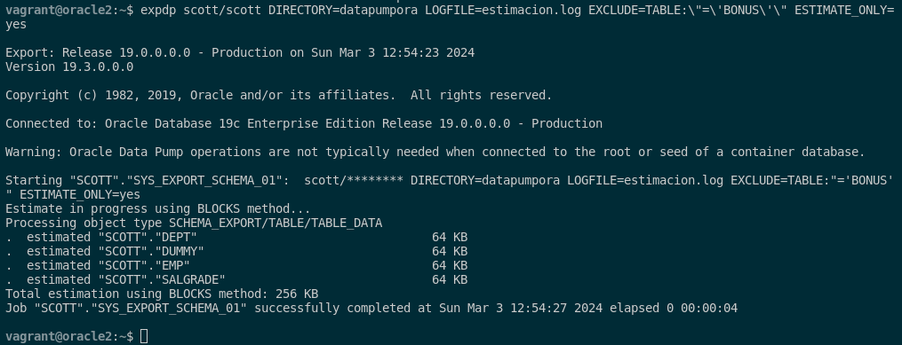

Tras esto, realizaremos la exportación del esquema con las especificaciones que nos pide (que son excluye la tabla BONUS y los departamentos con menos de dos empleados):

```sql
expdp scott/scott DIRECTORY=datapumpora DUMPFILE=scott.dmp CONTENT=ALL LOGFILE=export.log SCHEMAS=SCOTT EXCLUDE=TABLE:"IN('BONUS')" QUERY=DEPT:'"WHERE DEPTNO IN (SELECT DEPTNO FROM EMP GROUP BY DEPTNO HAVING COUNT(*) >= 2)"' JOB_NAME=scott_exportacion
```

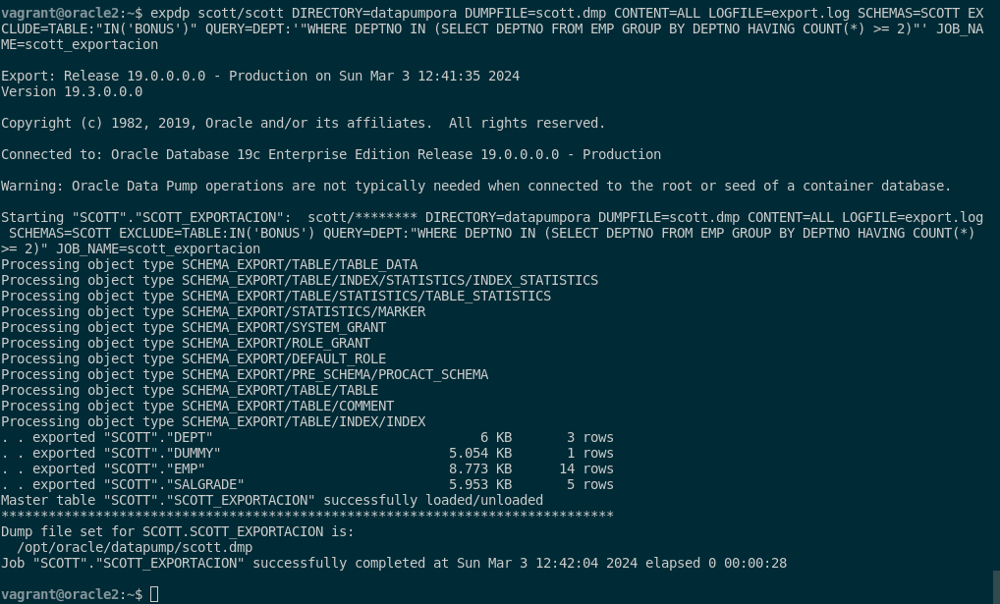

Con la exportación ya hecha, las características de este comando **expdp** con las siguientes:

- `DIRECTORY`: Especifica el directorio donde se guardarán los archivos de exportación y registro.

- `DUMPFILE`: Define el nombre del archivo de exportación.

- `LOGFILE`: Indica el nombre del archivo de registro y su ubicación.

- `SCHEMAS`: Especifica el esquema de la base de datos que se exportará.

- `EXCLUDE`: Permite EXCLUDE ciertos objetos de la exportación.

- `ESTIMATE_ONLY`: Indica si se debe realizar una estimación del tamaño necesario para la exportación.

- `JOB_NAME`: Proporciona un nombre al trabajo de exportación.

Tras la exportación de tanto el fichero de log de estimación, el fichero de exportación y el fichero de log de la exportación, podemos verlo en la ruta que hemos especificado.

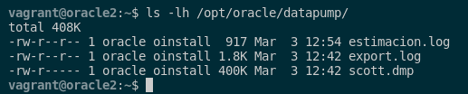

El contenido de cada uno es el siguiente:

- Fichero de log de estimación:

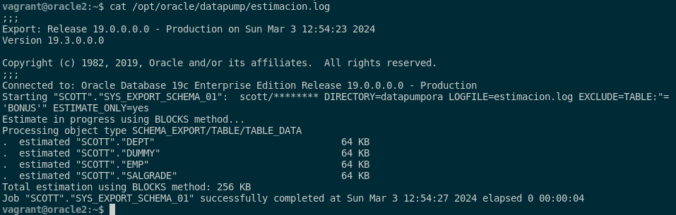

- Fichero de exportación:

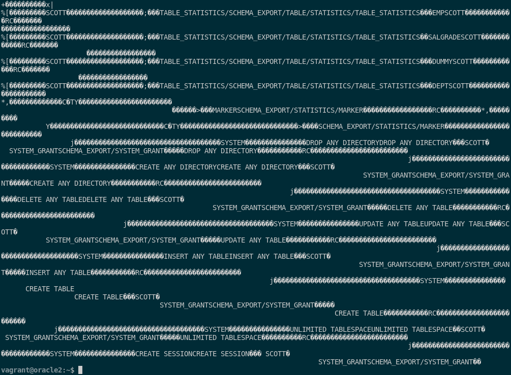

- Fichero de log de la exportación:

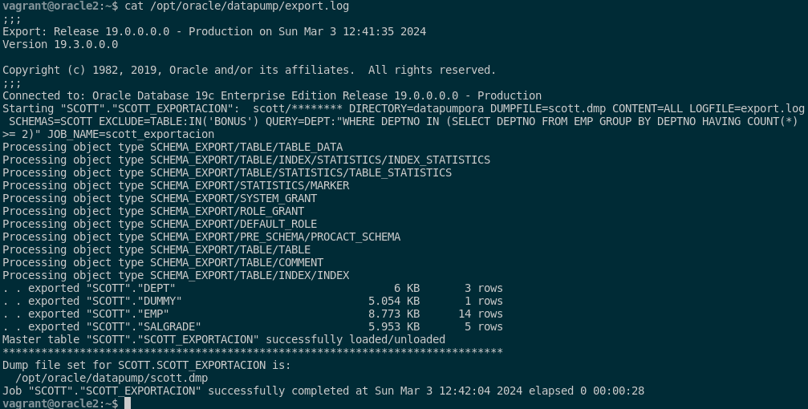

Con esto hecho, pasamos a la programación de la exportación para dentro de 2 minutos, que lo crearemos de la siguiente manera:

```sql
nano export.sh

#!/bin/bash

FECHA=`date +%Y%m%d%H%M%S`
USER=scott
PASSWORD=scott
SCHEMA=scott
EXCLUDE=TABLE:"IN('BONUS')"
QUERY=DEPT:'"WHERE DEPTNO IN (SELECT DEPTNO FROM EMP GROUP BY DEPTNO HAVING COUNT(*) >= 2)"'
EXPORTACION=/opt/oracle/datapump
DIRECTORY=datapumpora
NOMBRE_EXPORTACION=export_$FECHA
NOMBRE_ESTIMACION=estimacion_$FECHA

expdp $USER/$PASSWORD DIRECTORY=$DIRECTORY CONTENT=ALL LOGFILE=$NOMBRE_ESTIMACION.log SCHEMAS=$SCHEMA ESTIMATE_ONLY=y

sleep 10

expdp $USER/$PASSWORD directory=$DIRECTORY dumpfile=$NOMBRE_EXPORTACION.dmp logfile=$NOMBRE_EXPORTACION.log SCHEMAS=$SCHEMA EXCLUDE=$EXCLUDE QUERY=$QUERY JOB_NAME=$NOMBRE_EXPORTACION
```

Cuando ya lo tengamos creado, le damos permisos de ejecución y lo ejecutamos con los siguientes comandos:

```sql
sudo chmod a+x export.sh
. export.sh
```

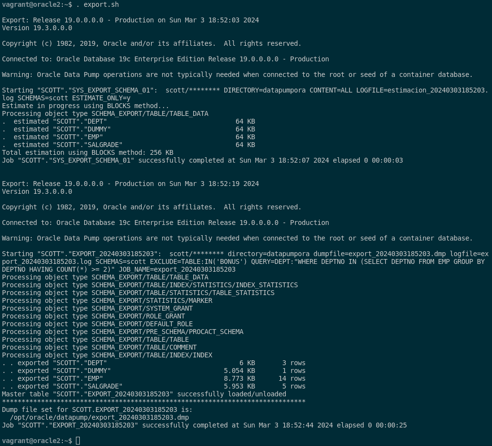

Como podemos ver el script funciona de manera correcta y por ello, podemos ver que los ficheros se han creado correctamente observando en la ruta donde hemos querido que se guarden los archivo en el script:

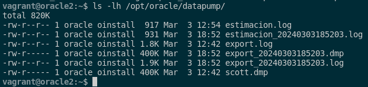

Si queremos poner el temporizador cada 2 minutos al script, lo podemos poner ejecutando un crontab y poniendo la siguiente regla en el fichero:

```sql
crontab -e
*/2 * * * * /home/vagrant/export.sh
```

Este se ejecutará en bucle cada minutos.