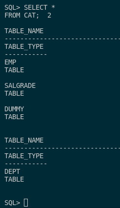

### 2. Importa el fichero obtenido anteriormente usando Oracle Data Pump pero en un usuario distinto de la misma base de datos.

Para ello, lo que haré será crear un usuario el cual le daré los mismos permisos que le dí al usuario scott. Las siguientes directivas serán ejecutadas como DBA:

- Primero, habilitaremos el sript de Oracle por defecto con el siguiente comando:

```sql
alter session set "_ORACLE_SCRIPT"=true;
```

- Segundo, creamos el usuario con permisos para poder conectarse y recolectar información sobre la base de datos:

```sql
CREATE USER scott2 IDENTIFIED BY scott2;
ALTER USER scott2 ACCOUNT UNLOCK;
GRANT CONNECT, RESOURCE TO scott2;
```

- Seguido de esto, le daremos a este usuario permisos para tener espacio ilimitado sobre cualquier tablespace, además de otorgarle permisos sobre el tablespace **USERS** y el tablespace temporal **TEMP**:

```sql
GRANT UNLIMITED TABLESPACE TO scott2;
ALTER USER scott2 DEFAULT TABLESPACE USERS;
ALTER USER scott2 TEMPORARY TABLESPACE TEMP;
```

- Por último, le daremos los permisos para poder leer y escribir en el directorio que creamos anteriormente:

```sql
GRANT READ,WRITE ON DIRECTORY datapumpora TO scott2;
GRANT IMP_FULL_DATABASE TO scott2;
```

Seguido de esto, para realizar la importación, usaremos el comando **impdp** con las siguientes directivas:

```sql
impdp scott2/scott2 DIRECTORY=datapumpora DUMPFILE=scott.dmp LOGFILE=scott_import.log SCHEMAS=scott REMAP_SCHEMA=scott:scott2
```


Como podemos ver, se ha importado de manera correcta y para poder ver que se importado de manera correcta ejecutaremos esta consulta y veremos que se ha importado correctamente y no se ha pasado la tabla bonus que se pedía en el ejercicio anterior:

```sql
SELECT *
FROM CAT;
```



Si queremos ver si tienen los datos ejecutaremos las siguientes consultas:

```sql
SELECT *
FROM DEPT;
```


```sql
SELECT *
FROM EMP;
```


```sql
SELECT *
FROM SALGRADE;
```


```sql
SELECT *
FROM DUMMY;
```


Como vemos se ha importado correctamente.