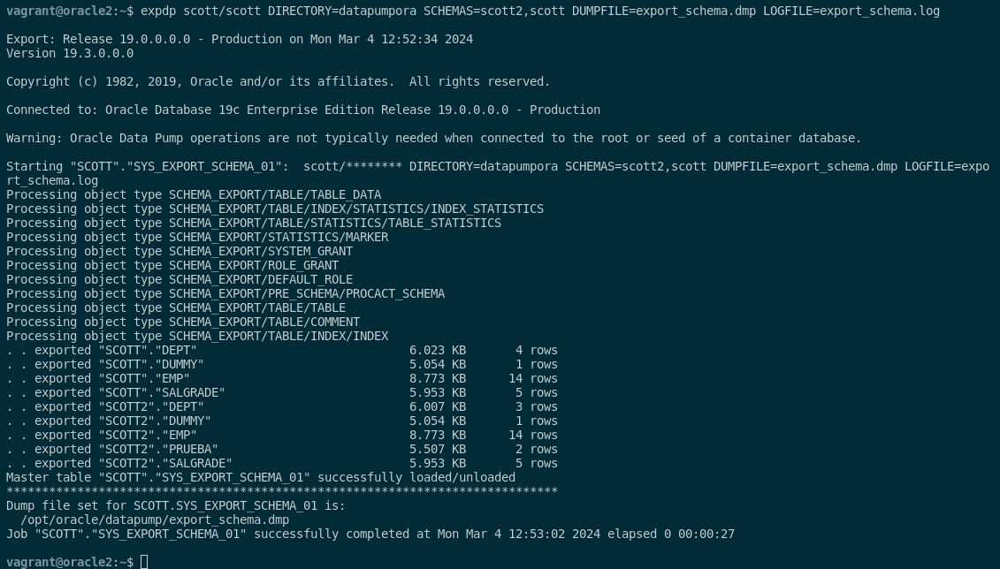
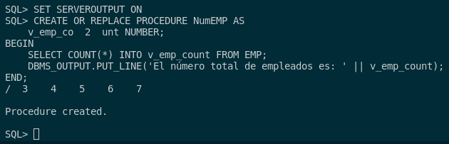
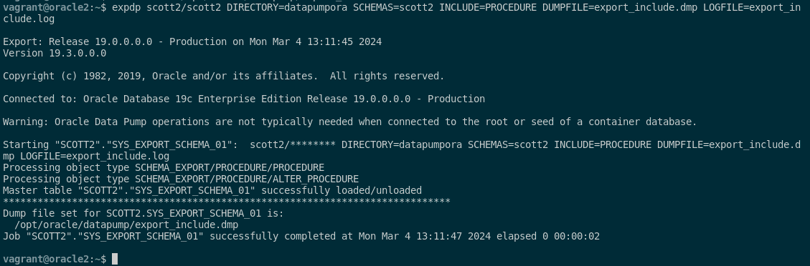
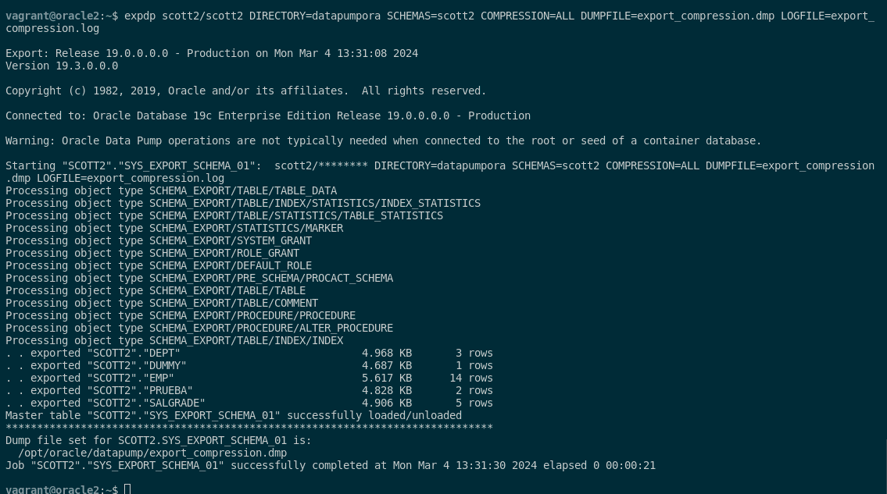
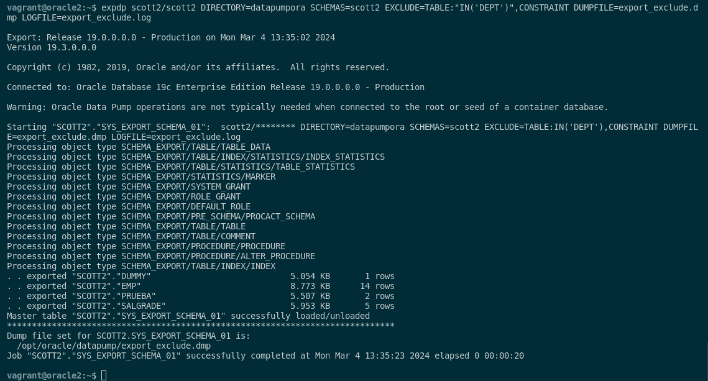
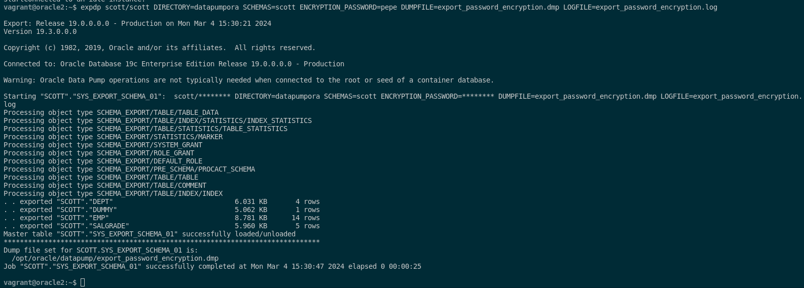
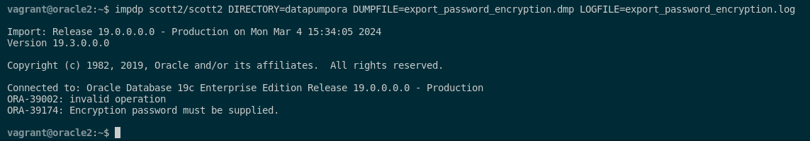
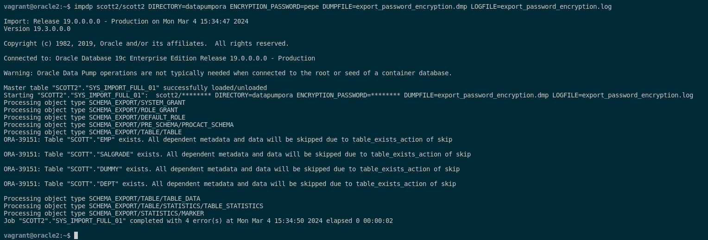
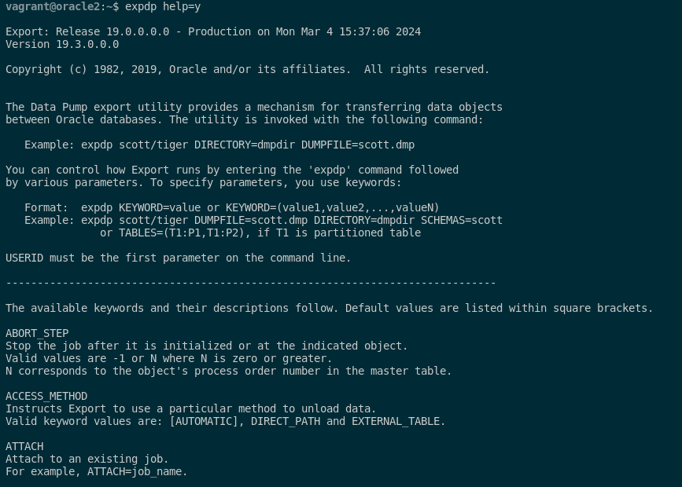

### 3. Realiza una exportación de la estructura de todas las tablas de la base de datos usando el comando expdp de Oracle Data Pump probando al menos cinco de las posibles opciones que ofrece dicho comando y documentándolas adecuadamente.

Para poder ejecutar el comando expdp con cada una de sus acciones, tendremos que explicar que hace dicho comando y sus respectivas acciones.

Por ello, este comando **expdp** que es de Oracle Data Pump nos sirve para realizar exportaciones de objatos y datos de nuestra base de datos Oracle. Las 5 opciones que nos pide el ejercicio son las siguientes:

- **`SCHEMAS`**: esta opción nos permite especificar el esquema que queremos exportar. Para realizar una práctica de esta opción, voy a crear un nuevo esquema en nuestra base de datos como usuario scott2/scott2 para poder hacer la exportación. Estas son las sentencias y para crearlo:

```sql
sqlplus scott2/scott2

CREATE TABLE prueba (
    id NUMBER,
    nombre VARCHAR2(50)
);

INSERT INTO prueba (id, nombre) VALUES (1, 'Ejemplo 1');
INSERT INTO prueba (id, nombre) VALUES (2, 'Ejemplo 2');
```

Tras esto, realizamos la exportación con el siguiente comando:

```sql
expdp scott/scott DIRECTORY=datapumpora SCHEMAS=scott2,scott DUMPFILE=export_schema.dmp LOGFILE=export_schema.log
```



Como podemos ver, la exportación se ha realizado correctamente ya que se además se ha exportado la tabla prueba que hemos insertado anteriormente. Si queremos mirar el contenido donde se ha guardado el fichero ejecutaremos el siguiente comando (en mi caso):

```sql
cat /opt/oracle/datapump/export_schema.log 
```

- **`INCLUDE`**: esta opción nos permite especificar los tipos de objetos que se pueden incluir en la exportación. Para poder probar esto, voy a crear un procedimiento y voy solo al almacenar procedimientos en la exportación. 

El procedimiento es el siguiente:

```sql
SET SERVEROUTPUT ON
CREATE OR REPLACE PROCEDURE NumEMP AS
    v_emp_count NUMBER;
BEGIN
    SELECT COUNT(*) INTO v_emp_count FROM EMP;
    DBMS_OUTPUT.PUT_LINE('El número total de empleados es: ' || v_emp_count);
END;
/
```



Este procedimiento lo que hace es que te muestra el número total de empleados. Tras esto, exportamos el contenido de este mismo con el siguiente comando:

```sql
expdp scott2/scott2 DIRECTORY=datapumpora SCHEMAS=scott2 INCLUDE=PROCEDURE DUMPFILE=export_include.dmp LOGFILE=export_include.log
```



Si queremos mirar el contenido donde se ha guardado el fichero ejecutaremos el siguiente comando (en mi caso):

```sql
cat /opt/oracle/datapump/export_include.log 
```

- **`COMPRESSION`**: esta opción nos permite especificar en que tipo de nivel queremos la exportación. Por ello, los valores pueden ser *ALL* para todo la compresión, *METADATA_ONLY* para ninguna compresión y un número entre 1 al 9 para poner un nivel específico. Para probarlo, le voy a poner un nivel ALL de compresión al siguiente comando:

```sql
expdp scott2/scott2 DIRECTORY=datapumpora SCHEMAS=scott2 COMPRESSION=ALL DUMPFILE=export_compression.dmp LOGFILE=export_compression.log
```



Si queremos mirar el contenido donde se ha guardado el fichero ejecutaremos el siguiente comando (en mi caso):

```sql
cat /opt/oracle/datapump/export_compression.log 
```

- **`EXCLUDE`**: esta opción nos permite especificar los tipos de objetos que se pueden excluir en la exportación. En mi caso, voy a excluir la tabla salgrade de la exportación y esto lo haré mediante este comando:

```sql
expdp scott2/scott2 DIRECTORY=datapumpora SCHEMAS=scott2 EXCLUDE=TABLE:"IN('DEPT')",CONSTRAINT DUMPFILE=export_exclude.dmp LOGFILE=export_exclude.log
```



Si queremos mirar el contenido donde se ha guardado el fichero ejecutaremos el siguiente comando (en mi caso):

```sql
cat /opt/oracle/datapump/export_exclude.log 
```

- **`ENCRYPTION_PASSWORD`**: esta opción nos permite especificar la contraseña que utilizado los datos exportados. Por ejemplo, para entender esto, vamos a realizar una exportación con contraseña de el esquema de scott con el siguiente comando:

```sql
expdp scott/scott DIRECTORY=datapumpora SCHEMAS=scott ENCRYPTION_PASSWORD=pepe DUMPFILE=export_password_encryption.dmp LOGFILE=export_password_encryption.log
```



Si queremos mirar el contenido donde se ha guardado el fichero ejecutaremos el siguiente comando (en mi caso):

```sql
cat /opt/oracle/datapump/export_password_encryption.log 
```

Cuando lo exportemos, se lo importaremos al usuario scott2 sin contraseña y veremos que nos dará problemas porque falta dicha contraseña; aplicaremos el siguiente comando:

```sql
impdp scott2/scott2 DIRECTORY=datapumpora DUMPFILE=export_password_encryption.dmp LOGFILE=export_password_encryption.log
```



Ahora probaremos a intrucirle la contraseña y veremos que nos deja perfectamente:

```sql
impdp scott2/scott2 DIRECTORY=datapumpora ENCRYPTION_PASSWORD=pepe DUMPFILE=export_password_encryption.dmp LOGFILE=export_password_encryption.log
```



En mi caso, ya tenía eso datos ya creados y por ello no se me han insertado pero con la acción **ENCRYPTION_PASSWORD** me ha dejado hacer la importación.

Si queremos ver más acciones de este mismo, si ejecutamos el siguiente comando, podremos ver todas las opciones que nos proporciona este comando:

```sql
expdp help=y
```

