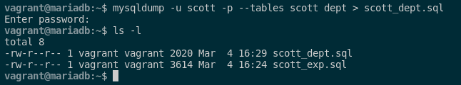

### 4. Intenta realizar operaciones similares de importación y exportación con las herramientas proporcionadas con MySQL desde línea de comandos, documentando el proceso.

Para poder exportar datos en MySQL, podremos utilizar el comando **mysqldump**. Este comando nos sirve para realizar copias de la base de datos de MySQL, dándonos un abanico de posibilidades a la hora de exportar tablas, vistas...

Para poder realizar una exportación de la base de datos completa en el esquema scott, ejecutaremos el siguiente comando:

```sql
mysqldump -u scott -p scott > scott_exp.sql
```


En este archivo se encuntra todas las instrucciones SQL de nuestra base de datos scott y podemos ver el contenido de este mismo con este comando:

```sql
cat scott_exp.sql
```


También en MySQL existe como en Oracle la opción **INCLUDE** y incluimos una tabla la cual queramos hacer la exportación. En mi caso, si lo quiero hacer con la tabla DEPT tendremos que ejecutar el siguiente comando:

```sql
mysqldump -u scott -p --tables scott dept > scott_dept.sql
```



En este archivo se encuntra las instrucciones SQL de nuestra base de datos scott para la tabla DEPT y podemos ver el contenido de este mismo con este comando:

```sql
cat scott_dept.sql
```


Pasamos a la importación de ficheros .sql. Para ello, crearé un usuario y una base de datos limpia a la cual le daré permisos a ese usuarios sobre es base de datos. Esto lo haremos mediante estos comandos:

- Primero, crearemos la base de datos y el usuario:

```sql
CREATE DATABASE scott2;
CREATE USER scott2 IDENTIFIED BY 'scott2';
```

- Seguido de esto, le damos permisos a ese usuario sobre esa base de datos:

```sql
GRANT ALL PRIVILEGES ON scott2.* TO scott2;
FLUSH PRIVILEGES;
```

Cuando ya tengamos la configuración del usuario y la base de datos terminada, pasamos a la importación del fichero. Esto se hará mediante este comando:

```sql
mysql -u scott2 -p scott2 < scott_exp.sql
```
Cuando lo tengamos accedemos a la base de datos y vemos que las tablas se han pasado correctamente.

