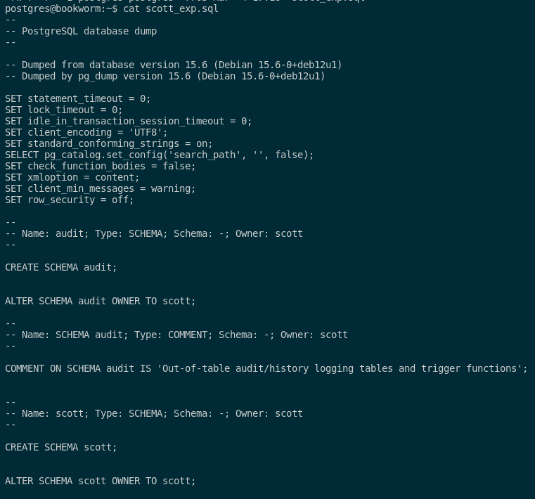

### 5. Intenta realizar operaciones similares de importación y exportación con las herramientas proporcionadas con Postgres desde línea de comandos, documentando el proceso.

En PostgreSQL tambien puede exportar datos, pero en este sistema gestor de base de datos, con el comando **pg_dump**. Este comando  nos sirve para realizar copias de la base de datos de PostgreSQL, dándonos un abanico de posibilidades a la hora de exportar tablas, vistas, procedimientos...  

Para poder realizar una exportación de la base de datos completa en el esquema scott, ejecutaremos el siguiente comando:

```sql
pg_dump -U postgres scott > scott_exp.sql
```


En este archivo se encuntra todas las instrucciones SQL de nuestra base de datos scott y podemos ver el contenido de este mismo con este comando:

```sql
cat scott_exp.sql
```



También en PostgreSQL existe como en Oracle la opción **INCLUDE** y incluimos una tabla la cual queramos hacer la exportación. En mi caso, si lo quiero hacer con la tabla DEPT tendremos que ejecutar el siguiente comando:

```sql
pg_dump -U postgres --table scott.emp > scott_dept.sql
```


En este archivo se encuntra las instrucciones SQL de nuestra base de datos scott para la tabla DEPT y podemos ver el contenido de este mismo con este comando:

```sql
cat scott_dept.sql
```


Pasamos a la importación de ficheros .sql. Para ello, crearé una base de datos limpia para poder realizar la importación de este mismo. El comando que utilizaré para importar será el siguiente:

```sql
psql -U postgres -d scott2 -f scott_exp.sql
```


Cuando lo tengamos accedemos a la base de datos y vemos que las tablas se han pasado correctamente.

