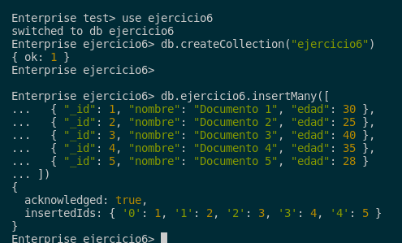
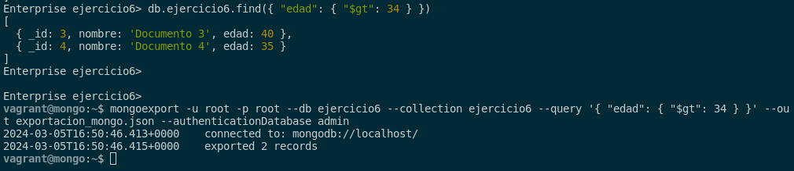
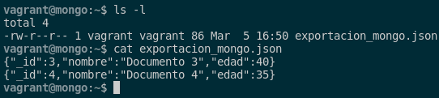
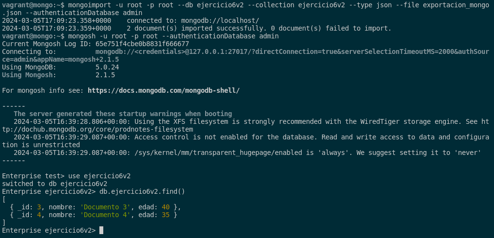

### 6. Exporta los documentos de una colección de MongoDB que cumplan una determinada condición e impórtalos en otra base de datos.

En PostgreSQL tambien puede exportar datos, pero en este sistema gestor de base de datos, con el comando **mongoexport**. Este comando tiene opciones adicionales que las veremos seguidamente.

En mi caso para realizar las pruebas voy crear una base de datos, una colección y unos inserts para realizar la prueba y cuando exportemos vamos a poner que nos exporte los datos que tengan una edad superior a los 34 años. Además, utilizaré una base de datos de Mongo Enterprise. Para ello, utilizaremos los siguientes comandos:

```sql
mongosh -u admin -p admin --authenticationDatabase admin

use ejercicio6

db.createCollection("ejercicio6")

db.ejercicio6.insertMany([
  { "_id": 1, "nombre": "Documento 1", "edad": 30 },
  { "_id": 2, "nombre": "Documento 2", "edad": 25 },
  { "_id": 3, "nombre": "Documento 3", "edad": 40 },
  { "_id": 4, "nombre": "Documento 4", "edad": 35 },
  { "_id": 5, "nombre": "Documento 5", "edad": 28 }
])
```



Por ello, el comando para exportarlo es el siguiente:

```sql
mongoexport -u root -p root --db ejercicio6 --collection ejercicio6 --query '{ "edad": { "$gt": 34 } }' --out exportacion_mongo.json --authenticationDatabase admin
```



Como podemos ver en la consulta de arriba, solo nos debería expotar 2 documentos y eso es lo que nos ha exportado. Podemos ver el contenido de este mismo con este comando:

```sql
cat exportacion_mongo.json
```



Tras esto, para poder mportar los datos en otra base de datos, tendremos utilizar el comando **mongoimport**. Para realizar la prueba, tendremos que crear una base de datos y una colección nueva con los siguiente comandos:

```sql
mongosh -u root -p root --authenticationDatabase admin
use ejercicio6v2
db.createCollection("ejercicio6v2")
```

Seguido de esto, lo importamos con el siguiente comando:

```sql
mongoimport -u root -p root --db ejercicio6v2 --collection ejercicio6v2 --type json --file exportacion_mongo.json --authenticationDatabase admin
```



Como vemos se ha importado de manera correcta solo los datos que cumplían la condición que hemos impuesto en la exportación.