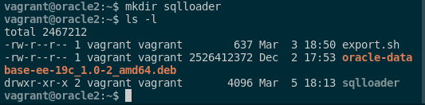

### 7. SQLLoader es una herramienta que sirve para cargar grandes volúmenes de datos en una instancia de ORACLE. Exportad los datos de una base de datos completa desde MariaDB a texto plano con delimitadores y emporalead SQLLoader para realizar el proceso de carga de dichos datos a una instancia ORACLE. Debéis documentar todo el proceso, explicando los distintos ficheros de configuración y de log que tiene SQL*Loader.

Para realizar la prueba de esto, lo que haré será exportar los datos de la tabla dept de la base de datos scott en PostreSQL mediante texto plano con delimitadores. Primero lo que haremos, será crear el directorio donde vamos a realizar la exportación de la tabla dept.

```sql
mkdir -p /var/lib/postgresql/sqlloader/
ls -ld /var/lib/postgresql/sqlloader/
```

Si vemos que el propietario no es postgres, lo cambiamos para que lo sea con este comando:

```sql
chown -R postgres:postgres /var/lib/postgresql/sqlloader/
```

Por último, realizamos el siguiente comando para hacer una copia de la tabla empora:

```sql
psql -h localhost -U scott -d scott
COPY dept TO '/var/lib/postgresql/sqlloader/dept.csv' DELIMITERS',';
```


Si queremos ver que se ha creado correctamente, ejecutamos el siguiente comando:

```sql
ls -l /var/lib/postgresql/sqlloader/
```

Con esto hecho, para poder seguir el proceso completo de configuración y el uso de SQLLoader, necesitamos cargar los datos exportado de mi base de datos PostgreSQL a mi base de datos Oracle.

Para esto, crearemos una tabla empora con los mismos tipos de datos que en la tabla de PostgreSQL pero adaptados a mi base de datos de Oracle. Estos datos insertaremos un usuario nuevo que crearemos con los comandos siguientes:

```sql
alter session set "_ORACLE_SCRIPT"=true;
CREATE USER empora IDENTIFIED BY empora;
ALTER USER empora ACCOUNT UNLOCK;
GRANT CONNECT, RESOURCE TO empora;
GRANT UNLIMITED TABLESPACE TO empora;
ALTER USER empora DEFAULT TABLESPACE USERS;
ALTER USER empora TEMPORARY TABLESPACE TEMP;
```


Por ello, crearemos una tabla en Oracle que se va a llamar dept que será la siguiente:

```sql
sqlplus empora/empora;

CREATE TABLE dept (
  deptno   NUMBER(2) NOT NULL,
  dname    VARCHAR2(14),
  loc      VARCHAR2(13)
);
```



Tras esto, crearemos un archivo para la tabla dept para que SQLLoader pueda hacer la importación. Seguido a esto, crearemos la carpeta donde guardaremos este archivo.

```sql
mkdir sqlloader
```


El archivo tendrá el siguiente contenido:

```sql
nano sqlloader/dept.ctl

LOAD DATA
INFILE '/home/vagrant/sqlloader/dept.csv'
INTO TABLE dept
FIELDS TERMINATED BY ','
TRAILING NULLCOLS
(deptno, dname, loc)
```

Cada una de las directivas hace lo siguiente:

- **`LOAD DATA`**: Carga datos desde un archivo.

- **`INFILE`**: Especifica el archivo de origen.

- **`INTO TABLE`**: Indica la tabla de destino.

- **`FIELDS TERMINATED BY`**: Define el separador entre campos.

- **`TRAILING NULLCOLS`**: Rellena campos vacíos con NULL.

- **`(campos)`**: Lista de campos en la tabla de destino.

Tras esto, utilizaremos el comando de SQLLoader para importar el archivo con los parámetros que hemos comentado anteriormente. Para ello, aplicaremos el siguiente comando:

```sql
sqlldr empora/empora control=/home/vagrant/sqlloader/dept.ctl log=/home/vagrant/log/dept.log
```


Si queremos ver información de los logs de este proceso, ejecutamos el siguiente comando:

```sql
cat log/dept.log
```


Tras esto, para comprobar que se han pasado de manera correcta accederemos y veremos mediante la consulta de la captura que se ha pasado de manera correcta:

