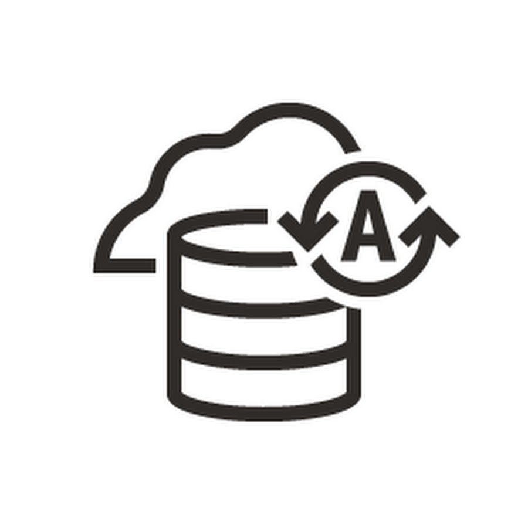

# BBDD - Movimiento-datos

Práctica de invididual de movimiento de datos.

Realizada por Jose Carlos Rodríguez Cañas.

[1. Realiza una exportación del esquema de SCOTT usando Oracle Data Pump con las siguientes condiciones:
• Exporta tanto la estructura de las tablas como los datos de las mismas.
• Excluye la tabla BONUS y los departamentos con menos de dos empleados.
• Realiza una estimación previa del tamaño necesario para el fichero de exportación.
• Programa la operación para dentro de 2 minutos.
• Genera un archivo de log en el directorio raíz.](/Ejercicios/Ejercicio1.md)

[2. Importa el fichero obtenido anteriormente usando Oracle Data Pump pero en un usuario distinto de la misma base de datos.](/Ejercicios/Ejercicio2.md)

[3. Realiza una exportación de la estructura de todas las tablas de la base de datos usando el comando expdp de Oracle Data Pump probando al menos cinco de las posibles opciones que ofrece dicho comando y documentándolas adecuadamente.](/Ejercicios/Ejercicio3.md)

[4. Intenta realizar operaciones similares de importación y exportación con las herramientas proporcionadas con MySQL desde línea de comandos, documentando el proceso.](/Ejercicios/Ejercicio4.md)

[5. Intenta realizar operaciones similares de importación y exportación con las herramientas proporcionadas con Postgres desde línea de comandos, documentando el proceso.](/Ejercicios/Ejercicio5.md)

[6. Exporta los documentos de una colección de MongoDB que cumplan una determinada condición e impórtalos en otra base de datos.](/Ejercicios/Ejercicio6.md)

[7. SQL*Loader es una herramienta que sirve para cargar grandes volúmenes de datos en una instancia de ORACLE. Exportad los datos de una base de datos completa desde MariaDB a texto plano con delimitadores y emplead SQL*Loader para realizar el proceso de carga de dichos datos a una instancia ORACLE. Debéis documentar todo el proceso, explicando los distintos ficheros de configuración y de log que tiene SQL*Loader.](/Ejercicios/Ejercicio7.md)

